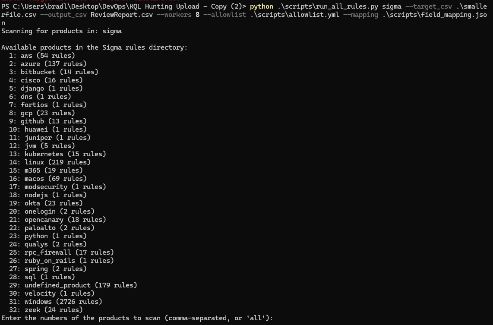

# Sigma Defender CSV Hunter

**Scan Microsoft Defender timeline CSVs with thousands of Sigma rules for deep, offline threat hunting and enhanced incident response.**

---

## Table of Contents

*   [Overview](#overview)
    *   [What are Sigma Rules?](#what-are-sigma-rules)
    *   [Why is this Project Helpful? The Challenge with Traditional Detection](#why-is-this-project-helpful-the-challenge-with-traditional-detection)
    *   [How This Project Solves the Problem & Enhances Investigations](#how-this-project-solves-the-problem--enhances-investigations)
*   [Key Features](#key-features)
*   [Screenshots of the Tool in Action](#screenshots-of-the-tool-in-action)
*   [Getting Started](#getting-started)
    *   [Prerequisites](#prerequisites)
    *   [Installation](#installation)
    *   [Initial Configuration](#initial-configuration)
*   [How it Works & Usage](#how-it-works--usage)
    *   [Main Usage Command](#main-usage-command)
    *   [Other Useful Scripts](#other-useful-scripts)
*   [Understanding the Output](#understanding-the-output)
    *   [Console Summary](#console-summary)
    *   [CSV Reports](#csv-reports)
*   [Sigma Rule Mapping & Coverage Considerations](#sigma-rule-mapping--coverage-considerations)
*   [Scripts Overview](#scripts-overview)
*   [Future Improvements & Automation Ideas](#future-improvements--automation-ideas)
*   [Acknowledgements](#acknowledgements)
*   [Contributing](#contributing)
*   [License](#license)

---

## Acknowledgements

This project was developed by Bradley Carpenter.

Special thanks to **James Naylor** and **Wun Frotan** for their significant contributions and assistance with some of the Python coding aspect in Sigma rule translation engine including the Shunting-yard algorithm for condition parsing and RPN evaluation and the multiprocessing framework in [`scripts/run_all_rules.py`](scripts/run_all_rules.py:1). 

This collaboration significantly optimized performance, reducing processing time from approximately one hour to around five minutes.

---

## Overview

This project offers a collection of Python scripts designed to translate and apply [Sigma rules](https://github.com/SigmaHQ/sigma) against endpoint data exported from Microsoft Defender (typically a `timeline.csv` file). It enables security analysts and threat hunters to leverage the vast Sigma rule-set for offline analysis of Defender's rich telemetry, significantly extending detection capabilities beyond the typical number of active rules in a SIEM.

### What are Sigma Rules?

[Sigma](https://github.com/SigmaHQ/sigma) is a generic and open signature format that allows security professionals to describe relevant log events in a structured manner. Rules can be written once and then converted for various SIEM systems and log management tools. It serves as a common language for detection logic across different platforms. There are thousands of community-contributed Sigma rules covering a wide array of TTPs (Tactics, Techniques, and Procedures).

### Why is this Project Helpful? The Challenge with Traditional Detection

*   **Cost & Performance of Large-Scale SIEM Deployments:** Running thousands of detection rules (like the full Sigma ruleset, which can exceed 3000+ rules) in real-time within a Security Information and Event Management (SIEM) system can be resource-intensive and costly. This often requires significant infrastructure and leads many organizations to curate a smaller subset (e.g., 100-500) of highly tuned rules for live alerting.
*   **Alert Fatigue & Initial Triage:** When an alert does fire from the SIEM, analysts often need more context. The initial alert might not provide enough information for a quick, informed decision. Standard procedure frequently involves manually pulling broader logs for the affected endpoint.
*   **Limited Scope of Live Detections:** While a SIEM might be monitoring for a few hundred critical use cases, an attacker might employ techniques not covered by those live rules, potentially evading initial detection.

### How This Project Solves the Problem & Enhances Investigations

This toolkit allows for a different approach: **offline, deep-dive analysis**.

1.  **Broaden Detection Coverage:** Instead of being limited by the performance constraints of a live SIEM, a much larger set of Sigma rules (potentially thousands) can be run against historical Defender timeline data. This significantly increases the chances of finding suspicious activities that might have been missed by live alerts.
2.  **Enrich Incident Response:** When an alert occurs (from any source), an analyst can:
    *   Pull the relevant Defender timeline logs for the endpoint(s) in question (e.g., for the past 7-30 days).
    *   Run this toolkit against those logs with a comprehensive set of Sigma rules.
    *   The output provides a detailed report of *all* Sigma rules that matched, offering a much richer contextual view of what happened on the endpoint around the time of the initial alert. This can help uncover related malicious activities, attacker TTPs, or the full scope of a compromise.
3.  **Proactive Threat Hunting:** Periodically export Defender timeline data from key assets and run it through this toolkit to proactively hunt for threats that haven't triggered live alerts.

The core idea is to map Sigma's generic field names to the specific column headers found in Defender CSV exports. The scripts then normalize this data and translate Sigma rule logic into pandas queries to scan the CSV.

---

## Key Features

*   **Sigma Rule Translation:** Converts Sigma rule detection logic into pandas queries.
*   **Flexible Field Mapping:** Define custom mappings between Sigma fields and your CSV columns via [`scripts/field_mapping.json`](scripts/field_mapping.json:1). This includes normalization of log source categories to Defender `Action Type` values.
*   **Performance Optimized:**
    *   **Action Type Pre-filtering:** Significantly speeds up processing by first filtering the CSV based on `logsource.category` to `Action Type` mappings.
    *   **Multiprocessing:** Utilizes multiple CPU cores for parallel rule processing using [`scripts/run_all_rules.py`](scripts/run_all_rules.py:1).
*   **Interactive Product Selection:** Choose which `logsource.product` (e.g., `windows`, `linux`) rules to run.
*   **Allowlisting/Suppression:** Filter out known benign events using a configurable [`scripts/allowlist.yml`](scripts/allowlist.yml:1) template to reduce noise.
*   **Comprehensive Reporting & Output:** Generates detailed CSV reports of detections and a summary of rule processing.
*   **Rich Operator Support:** Implements common Sigma value modifiers (e.g., `contains`, `endswith`, `startswith`, `equals`, `regex`, `CIDR`), with case-insensitive matching for string comparisons and intelligent path handling for operators like `startswith` and `endswith`.
*   **Advanced Condition Evaluation:** Handles complex Sigma detection logic, including nested conditions, boolean operators (`AND`, `OR`, `NOT`), quantifiers (`all of`, `1 of`, etc.), and accurate processing of Sigma selections defined as lists of maps, notably within [`scripts/apply_translated_rule.py`](scripts/apply_translated_rule.py:1).
*   **Robust Path Handling:** Intelligently constructs and compares file paths, considering components from different CSV fields.
*   **Utility Scripts:** Includes tools for extracting fields from Sigma rules, analyzing rule structures, debugging translations, and analyzing report details.

---

## Screenshots of the Tool in Action

**1. Initial Script Overview (when run with no arguments or `--help`):**


**2. Sigma Product Selection:**


**3. Scan Parameter Confirmation:**


**4. Scan in Progress (showing progress and detections):**


**5. Console Output Summary (after scan completion):**


**6. Example Excel Report (showing triggered rules and event details):**


---

## Getting Started

### Prerequisites

*   Python 3.x
*   Required Python libraries: `pandas`, `pyyaml`
*   Python library for enhanced CLI appearance: `colorama` (the script will function without it, but the banner will not be colored)

### Installation

1.  **Clone the repository (or download the files):**
    ```bash
    git clone <repository_url>
    cd <repository_directory>
    ```

2.  **Install dependencies:**
    ```bash
    # Required
    pip install pandas pyyaml
    # Recommended for a nicer CLI display
    pip install colorama
    ```

3.  **Prepare your data:**
    *   Have your Microsoft Defender timeline data CSV file ready (e.g., `timeline.csv`). This is typically exported from the Defender portal's advanced hunting capabilities or via API.
    *   Obtain Sigma rules. You can clone the official [SigmaHQ repository](https://github.com/SigmaHQ/sigma) or use your own collection. Place them in a directory (e.g., `sigma/`).

### Initial Configuration

1.  **Field Mapping (`scripts/field_mapping.json`):**
    *   The project is configured to use [`scripts/field_mapping.json`](scripts/field_mapping.json:1) by default. This file comes pre-defined with mappings tailored for common Microsoft Defender `timeline.csv` columns.
    *   It is recommended to **review this default file.** If your CSV export has different column names, or if you want to map additional Sigma fields, you will need to update it.
    *   Mappings are defined within the Python dictionaries in [`scripts/define_field_mapping.py`](scripts/define_field_mapping.py:1). After modifying this script, run:
        ```bash
        python scripts/define_field_mapping.py
        ```
        This will regenerate the default [`scripts/field_mapping.json`](scripts/field_mapping.json:1).
    *   **Using a Custom Mapping File:** If you prefer to use a mapping file with a different name or location, you can specify its path using the `--mapping` command-line argument when running scripts like `run_all_rules.py`.
    *   **Crucial Section:** Pay special attention to the `_logsource_category_to_action_type_` mapping within your field mapping file. This maps Sigma `logsource.category` (e.g., `process_creation`, `network_connection`) to specific `Action Type` values found in your Defender CSV. This pre-filtering step is vital for performance, especially with large CSV files.

2.  **Allowlist (`scripts/allowlist.yml`):**
    *   A template [`scripts/allowlist.yml`](scripts/allowlist.yml:1) is provided.
    *   **Crucially, customize this template** to define suppression rules for known benign activities specific to *your* environment. This is key to reducing false positives and making the output actionable. The template provides examples and explains the structure.

---

## How it Works & Usage

The core of the project is the translation of Sigma rule logic into queries that can be run against your CSV data.

1.  **Field Normalization:** Sigma rules use generic field names (e.g., `Image`, `CommandLine`). The [`scripts/field_mapping.json`](scripts/field_mapping.json:1) maps these to your specific CSV column names (e.g., `File Name`, `Process Command Line`).
2.  **Action Type Filtering:** Based on the Sigma rule's `logsource.category` (e.g., `process_creation`), the tool first filters the large CSV to only include relevant `Action Type` rows (e.g., `ProcessCreated`), drastically reducing the data processed per rule.
3.  **Condition Translation:** The detection logic within each Sigma rule (selections and conditions) is translated into a series of pandas DataFrame operations and queries. This complex translation, including handling of Sigma's condition syntax (like `1 of selection_*` or `selection1 and not selection2`), is a key part of [`scripts/apply_translated_rule.py`](scripts/apply_translated_rule.py:1).
4.  **Execution:** The [`scripts/run_all_rules.py`](scripts/run_all_rules.py:1) script orchestrates this process for multiple rules, using multiprocessing for speed.
5.  **Allowlisting:** Detected events are checked against your [`scripts/allowlist.yml`](scripts/allowlist.yml:1) before being included in the final report.
6.  **Reporting:** Results are aggregated into a main CSV report and a summary CSV.

### Main Usage Command

The primary script for threat hunting is [`scripts/run_all_rules.py`](scripts/run_all_rules.py:1).

```bash
python scripts/run_all_rules.py <path_to_sigma_rules_directory> --target_csv <path_to_your_timeline.csv> --output_csv <path_for_report.csv> [--workers <num_processes>] [--allowlist <path_to_allowlist.yml>] [--mapping <path_to_field_mapping.json>]
```

**Arguments:**

*   `<path_to_sigma_rules_directory>`: (Required) Directory containing Sigma rule `.yml` files (e.g., `./sigma/rules/windows`).
*   `--target_csv <path_to_your_timeline.csv>`: (Required) Path to your Defender timeline data.
*   `--output_csv <path_for_report.csv>`: (Required) Path to save the consolidated report of detected events.
*   `--workers <num_processes>`: (Optional) Number of worker processes for parallel scanning. Defaults to CPU core count.
*   `--allowlist <path_to_allowlist.yml>`: (Optional) Path to your custom allowlist. Defaults to `scripts/allowlist.yml` (the template).
*   `--mapping <path_to_field_mapping.json>`: (Optional) Path to your field mapping file. Defaults to `scripts/field_mapping.json`.

**Example:**

```bash
# Scan Windows threat hunting rules from the local 'sigma/rules-threat-hunting/windows' directory
# against 'downloaded_timeline.csv', using 4 workers, a custom allowlist,
# and save the report to 'hunt_report.csv'
python scripts/run_all_rules.py ./sigma/rules-threat-hunting/windows \
    --target_csv downloaded_timeline.csv \
    --output_csv hunt_report.csv \
    --workers 4 \
    --allowlist ./my_environment_allowlist.yml
```

**The script will:**

1.  Scan the Sigma rule directory for unique `logsource.product` values.
2.  Prompt you to select which products' rules to process (e.g., `windows`, `network`, `cloud`).
3.  Load suppression rules from your allowlist.
4.  Process selected rules in parallel, displaying progress.
5.  Apply allowlist rules to suppress known benign events.
6.  Save all aggregated, non-suppressed matching events to your output CSV.
7.  Generate a summary report detailing processing status for each rule.

### Other Useful Scripts

*   **Translate a Single Rule (for debugging field mappings & logic):**
    ```bash
    python scripts/translate_sigma_rule.py path/to/your/sigma_rule.yml
    ```
    This shows how a rule's logic is interpreted based on the field mapping, helping you understand if a field is unmapped or how conditions are structured.

*   **Apply a Single Rule to CSV (for focused testing):**
    ```bash
    python scripts/apply_translated_rule.py path/to/your/sigma_rule.yml --csv your_data.csv
    ```

---

## Understanding the Output

### Console Summary
After the scan completes, a summary is printed to the console, indicating total rules processed, matches found, and paths to the generated report files.

### CSV Reports
Two primary CSV files are generated:

1.  **Main Report CSV** (e.g., `detected_events_report.csv`): This file contains all rows from your input CSV that matched one or more non-suppressed Sigma rules. Each matching event is enriched with:
    *   `Sigma Rule Title`
    *   `Sigma Rule ID`
    *   `Sigma Rule Level` (critical, high, medium, low)
    *   `Sigma Rule Path` (path to the matched `.yml` rule file)

2.  **Summary Report CSV** (e.g., `detected_events_report_summary_report.csv`): This provides a meta-analysis of the scan, detailing for each processed Sigma rule:
    *   Rule Path, Title, ID, Level
    *   Number of matches found (after allowlisting)
    *   Processing status (e.g., "Processed - Matches Found", "Processed - No Matches", "Error")
    *   Any error information.
    *   A list of Sigma fields within the rule that were not mapped for its category (useful for extending `field_mapping.json`).

---

## Sigma Rule Mapping & Coverage Considerations

It's important to understand the scope and limitations of Sigma rule mapping in this project:

*   **Primary Focus on Windows Defender Logs:** The current field mappings in [`scripts/field_mapping.json`](scripts/field_mapping.json:1) are primarily tailored for **Windows** events as captured in typical Microsoft Defender timeline CSV exports. The initial mapping provided here covers many common fields for `process_creation` and `network_connection` events, with other Windows-related categories (`image_load`, `file_event`, etc.) having partial or placeholder mappings.
*   **Sigma's Broad Scope:** Sigma rules are designed for a wide array of log sources and products (Linux, macOS, network devices, cloud platforms, specific applications, etc.). Many rules in the public Sigma repository will target these other sources.
*   **Expected "Missing Logsource" Errors:** When running the script against a broad set of Sigma rules (e.g., the entire SigmaHQ repository), you **will** encounter errors like "Missing logsource.category" or "No field mapping for category 'XYZ'". This is expected. It means the rule is for a product or log category not currently mapped for Defender CSVs (e.g., a rule for `firewall` logs if only `process_creation` and `network_connection` from Defender are mapped, or a rule for a Linux-specific log). The script correctly identifies these, reports the issue, and skips the rule. This does not indicate a flaw in the script itself but rather the current scope of the mapping.
*   **Mapping Completeness for "Windows" Product:** Even within the "windows" product category of Sigma, not all sub-categories (e.g., `registry_event`, `pipe_created`, `driver_load`, `ps_module`, `ps_classic_start`, `wmi_event`) might have comprehensive field coverage in the default Defender timeline CSVs or in the current `field_mapping.json`. The effectiveness of a rule depends on the specific fields it uses and whether those fields are present and mapped in your Defender CSV export. For instance, out of approximately 2700+ Sigma rules for the "windows" product, the initial mapping in this project might successfully process a significant percentage for common event types like process creation, but rules relying on more obscure or less commonly exported Defender fields will result in "unmapped field" or "missing category" messages.
*   **Guidance from Summary Report:** The `_summary_report.csv` generated by `run_all_rules.py` includes an "Unmapped Fields" column. This can be very useful for identifying which Sigma fields, for a given category, are frequently encountered but not yet mapped, guiding future enhancements to `field_mapping.json`.
*   **Ongoing Effort:** While a substantial number of "windows" product rules can be processed, the mapping is an ongoing effort. The current focus has been on establishing a solid foundation for common Windows event types. Expanding this to cover more niche Windows log categories and other log sources is a significant undertaking and a key area for future improvement.

---

## Scripts Overview

All scripts are located in the `scripts/` directory. For detailed explanations of each script's purpose, inputs, outputs, and interactions, please refer to **[`SCRIPT_DETAILS.md`](SCRIPT_DETAILS.md:1)**.

*   **Core Execution:**
    *   [`scripts/run_all_rules.py`](scripts/run_all_rules.py:1): Main script for batch processing rules.
    *   [`scripts/apply_translated_rule.py`](scripts/apply_translated_rule.py:1): Engine for applying one Sigma rule to CSV data.
*   **Configuration & Mapping:**
    *   [`scripts/define_field_mapping.py`](scripts/define_field_mapping.py:1): Generates [`scripts/field_mapping.json`](scripts/field_mapping.json:1).
    *   [`scripts/field_mapping.json`](scripts/field_mapping.json:1): Stores Sigma-to-CSV field mappings.
    *   [`scripts/allowlist.yml`](scripts/allowlist.yml:1): Template for suppression rules.
*   **Analysis & Utilities:**
    *   [`scripts/extract_sigma_fields.py`](scripts/extract_sigma_fields.py:1): Extracts unique fields from Sigma rules.
    *   [`scripts/analyze_sigma_rules.py`](scripts/analyze_sigma_rules.py:1): Analyzes Sigma rule structures.
    *   [`scripts/translate_sigma_rule.py`](scripts/translate_sigma_rule.py:1): Debugs rule translation.
    *   [`scripts/test_translator.py`](scripts/test_translator.py:1): Tests the translator script.
    *   [`scripts/analyze_timeline_helper.py`](scripts/analyze_timeline_helper.py:1): Helps analyze rule matches from reports.
    *   [`scripts/analyze_report_details.py`](scripts/analyze_report_details.py:1): Analyzes report details and allowlist effectiveness.
    *   [`scripts/update_field_mapping.py`](scripts/update_field_mapping.py:1): Utility to help update field mappings.
    *   [`scripts/analyze_allowlist_candidates.py`](scripts/analyze_allowlist_candidates.py:1): Utility to help identify allowlist candidates.

---

---

## Future Improvements & Automation Ideas

*   **Expanded Field Mapping:** Continuously improve and expand [`scripts/field_mapping.json`](scripts/field_mapping.json:1) to cover more Sigma fields and logsource categories, particularly for various Windows event types and potentially other log sources if corresponding CSV data can be obtained. This is the primary area for increasing the percentage of successfully mapped Sigma rules.
*   **Enhanced Parsing:** More robust parsing for structured data within `Additional Fields` / `Typed Details` columns in Defender CSVs (e.g., JSON blobs).
*   **Advanced Data Types:** Better handling for non-string data types (integers, booleans, dates) in rule conditions.
*   **Full Sigma Modifier Support:** Systematically implement all relevant Sigma field value modifiers (e.g., `|base64offset`, `|expand`, `|utf16`, `|wide`).
*   **Event De-duplication:** Option to de-duplicate events in the final report if a single event matches multiple rules, perhaps by listing all matching rule IDs/titles in a single row.
*   **Central Configuration File:** For default paths to `timeline.csv`, `field_mapping.json`, Sigma rules directory, etc.
*   **Memory Optimization:** For extremely large CSVs, explore chunk processing (`pd.read_csv(..., chunksize=...)`).
*   **Granular Logging:** Implement Python's `logging` module for better control over verbosity and log output.
*   **Automated Testing:** Expand test suites for rule application logic.
*   **Integration with SOAR/Workflow Automation (Advanced):**
    *   **Automated Log Pull & Scan:** This toolkit can be integrated into automated security workflows. For example, when an alert fires in a SIEM (e.g., Sentinel, Splunk), a SOAR playbook could:
        1.  Automatically trigger an API call to Microsoft Defender to pull timeline logs for the affected endpoint for a specified period (e.g., last 7 days).
        2.  Execute the `run_all_rules.py` script against the downloaded logs.
        3.  Attach the generated CSV report (with potentially thousands of Sigma rule hits) to the original incident ticket.
    *   **Scheduled Proactive Hunts:** A scheduled task (e.g., GitHub Actions runner, Azure Function, cron job) could:
        1.  Periodically export logs from critical assets.
        2.  Run this script.
        3.  Push high/critical severity findings to a dedicated channel or ticketing system for review.
    *   This transforms the toolkit from a manual analysis aid into a component of an automated investigation pipeline, providing analysts with significantly more context almost immediately.

---


## Contributing

Contributions are welcome! Please feel free to submit pull requests, open issues, or suggest improvements.

*   Fork the repository.
*   Create a new branch (`git checkout -b feature/YourFeature`).
*   Commit your changes (`git commit -m 'Add some feature'`).
*   Push to the branch (`git push origin feature/YourFeature`).
*   Open a Pull Request.

---

## License

This project is licensed under the [MIT License](LICENSE.md).
